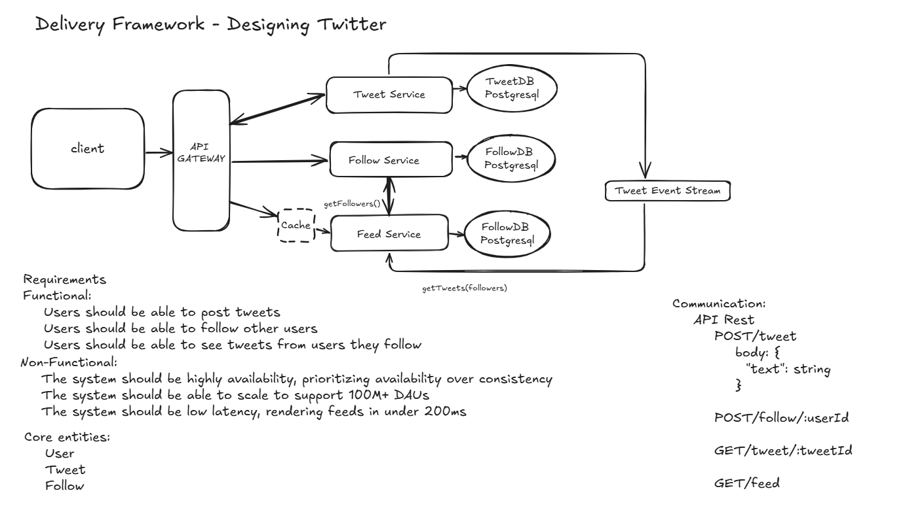

# Tweetter – System Design Case Study (MVP)

This project presents a high-level architectural design of **Twitter**, a simplified version of Twitter, focusing on scalability, availability, and low latency.

---

## 📌 Objective

Design a microservice-based backend architecture that supports:

- Posting tweets
- Following users
- Viewing a timeline feed of tweets from followed users

---

## 📐 Architecture Diagram

---

## ✅ Functional Requirements

- Users should be able to post tweets
- Users should be able to follow/unfollow others
- Users should be able to view tweets from people they follow (feed)

## ⚙️ Non-Functional Requirements

- High availability (favoring availability over strict consistency)
- Scalability to support 100M+ daily active users (DAUs)
- Latency under 200ms for rendering user feed

---

## 🧱 Key Components

| Component       | Description |
|----------------|-------------|
| **API Gateway** | Routes requests to backend services |
| **Tweet Service** | Handles tweet creation and retrieval |
| **Follow Service** | Manages follow relationships |
| **Feed Service** | Builds and serves user feeds using cache and event stream |
| **Tweet Event Stream** | Used to asynchronously update feeds |
| **Cache Layer** | Ensures fast delivery of feeds (<200ms) |
| **PostgreSQL Databases** | Stores persistent data for tweets and followers |

---

## 💡 Design Decisions

- Event-driven architecture for feed updates using pub/sub
- Cache for fast feed rendering
- CQRS-inspired separation between writing and reading
- Availability prioritized over strong consistency for social features

---

## 🛠️ Technologies 

This is a **design-only** project, but implementation could use:

- API Gateway - AWS API Gateway
- PostgreSQL for relational data
- Kafka for event streaming
- Redis for caching
- Docker for service isolation

